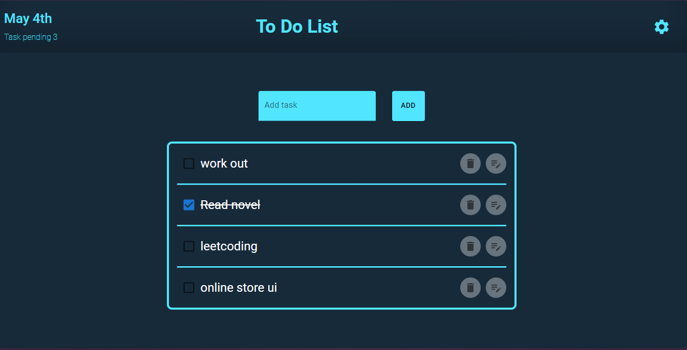

# React + TypeScript + Vite Todo App 

This is a todo application to which contain many best practices belonging to large scale projects.

## Feature 
- Basic CRUD operation
- Implementing MUI components
- Custom styling components

## Key takeaways 
1. How to use context API
2. A good directory structure.
3. passing of props and states between components.
4. Basics of typescript.
5. Basic MUI and custom components.

## Enhancements 
1. Make input field separate component.
2. Add button to task.
3. Fix mobile view